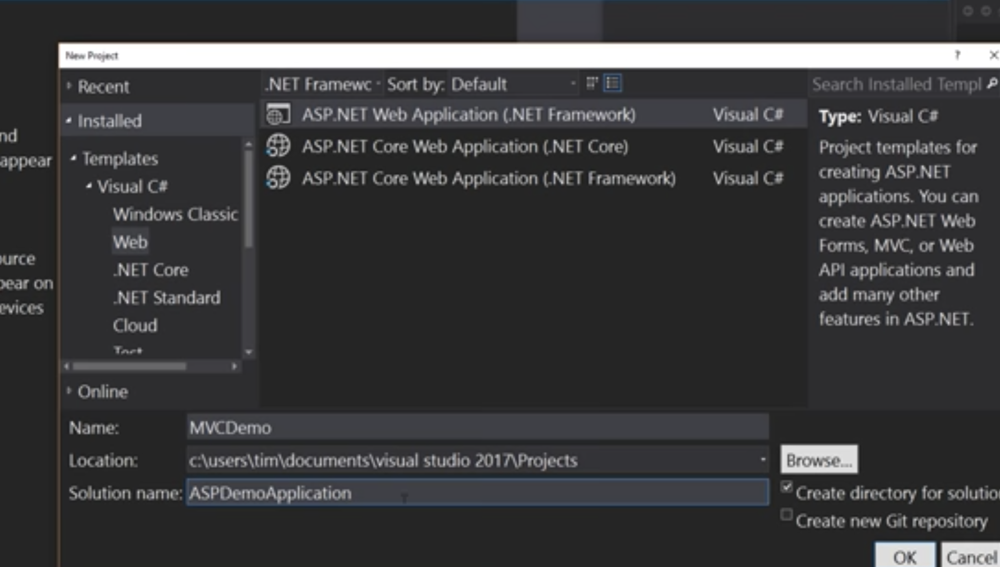

# WEB APP ASP.NET MVC 

  
Create a new application, make sure you select the one that says `web application`.  

  
  
Chose template as MVC, Web API is super awesome to look into and decouples from front end (focuses on just back end stuff. ).  
Now select no authentication, there is code for auth methods.   
When you select OK, the bottom left will import a bunch of components and download nugget packages.

## Nugget 
  
Microsoft package manager like brew or yum etc. So we can pull in jquery, bootstrap etc.  
